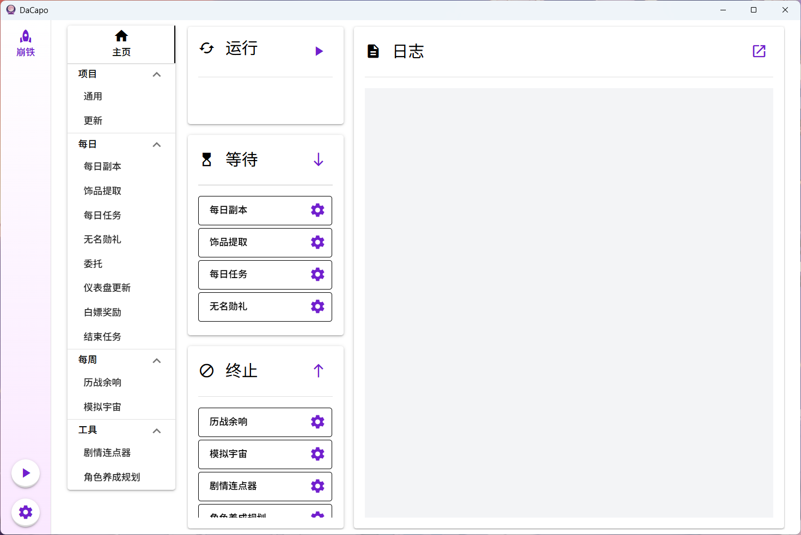
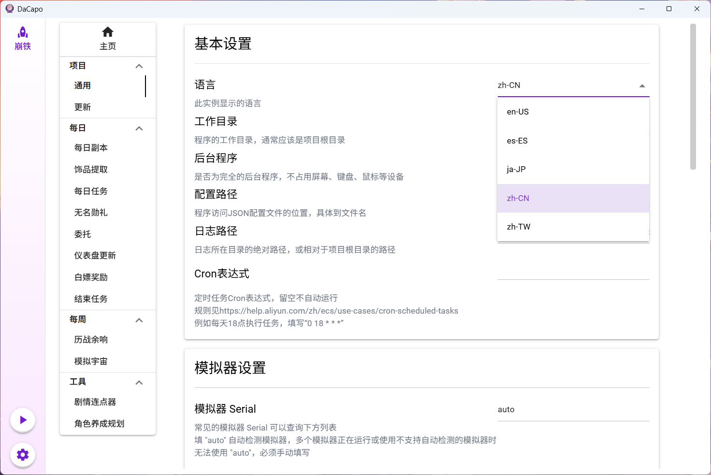
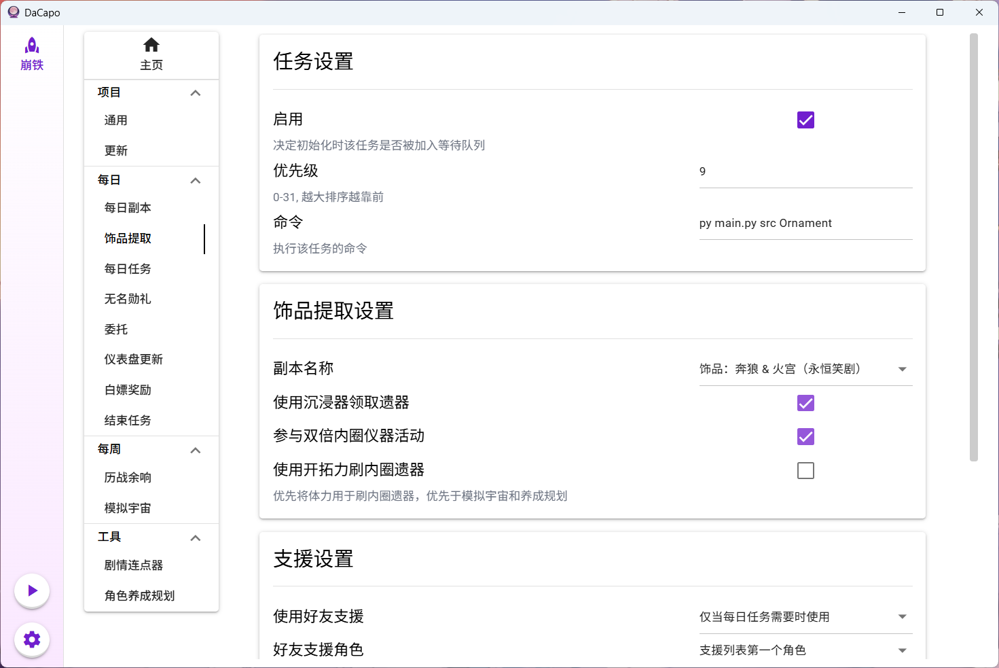

# DaCapo-SRC-Adapter
在[DaCapo](https://github.com/Aues6uen11Z/DaCapo)上运行[StarRailCopilot](https://github.com/LmeSzinc/StarRailCopilot)

# 使用方法

1. 下载安装最新版[DaCapo](https://github.com/Aues6uen11Z/DaCapo/releases/latest)
2. 按照SRC的安装说明**设置模拟器**，不用安装SRC

3. 打开DaCapo，点击左下角齿轮图标，在“创建新实例”一栏选择从远程创建，填写以下内容并点击创建：

   > 创建实例和第一次运行任务由于需要克隆仓库，需要确保Github连接通畅

   - 实例名称：随意
   - 模板名称：随意
   - 仓库地址：`https://github.com/Aues6uen11Z/DaCapo-SRC-Adapter`
   - 本地路径：`repos`
   - 分支：留空不填
   - 模板路径：`template`

4. 在创建的实例页面选择更新页面，点击右上角“检查更新”
5. 在其他设置页面修改自己的设置
6. 点击左下角或主页运行按钮开始运行，第一次需手动打开模拟器
